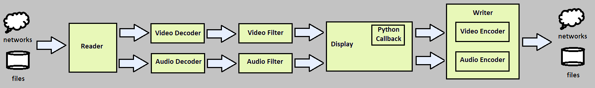

Application Structure
=====================

.. _module_and_queues:

Modules and Queues
------------------

A python application written with avio will construct a media processing
system consisting of modules that manipulate data and queues that transfer 
data between the modules.  The modules operate independently in parallel 
threads and send data to each other along queues that control the flow of 
data with thread blocking.

The modules represent discrete stages of media processing and are 
implemented as python objects.  Each module resides in it's own thread, and 
is disconnected from the operation of other modules.  This may sound like 
an obvious design trait, but is a departure from traditional programming 
using ffmpeg.  Legacy applications often are interconnected at many levels 
between processing stages, leading to unexpected results when changes are 
made to the design of an application.  The parallel processing design 
paradigm of avio enhances the stability of applications by virtue of the 
independence of the modules.

The queues control the flow of data between modules.  Queues employ thread 
locks to block modules from processing data if downstream operations require 
more time to finish.  The details of queue operation are abstracted away from 
the python developer, so there is no need to become familiar with the details 
of their operation.  It is important to note, however, that the default size 
of the queue is one.  This is done to keep the system responsive to user input 
for pause and seeking operations.  The exception to this default occurs when 
media arrives to the application over a network stream.  In this case, the 
structure and timing of incoming data may be such that the queue size must be 
increased for the Reader at the front end to prevent the loss of data by 
dropping frames.  Queues further downstream in this scenario will maintain their 
default size.  See the section on harvesting youtube data for a concrete example
of this effect.

.. _process_explain:

Process Object
--------------

The process object is the main object of an application and acts as the container for 
the modules and queues.  Module objects and their associated queues are contructed and
added to a process object.  Once all of the objects have been assembled into the process,
the process is started using the run command.  Once the process has started, it is not 
possible to change the structure of the modules or queues contained by it.  The user may
control the flow of data using pause and seek commands.

.. _display_explain:

Display Object
--------------

The display object has special properties that make it unique.  It presents the media to 
the user, both video and audio.  Although the python developer is not required to engage 
the details of operation, it can be helpful to understand, in general terms, the workings
of the underlying mechanisms.  For video data, the process resides in the main thread of
the application.  It also contains the thread of execution for the python video callback.
The audio data is processed in another thread, which is a callback to the display.  When
audio is present in the stream, it will control the timing of the display thread.  In the
absence of audio data, timing is controlled by the video stream.

There are some differences in how the display should be configured for video and audio.
The video display automatically detect the parameters from the stream and self configure.
The audio display, however, requires that the developer set the parameters prior to 
starting the process.  This is due to the callback nature of the audio display. The 
parameters that need to be set are             
            
.. code-block:: python
    
    Display.sample_rate
    Display.channels
    Display.channel_layout
    Display.sample_format
    Display.frame_size

These parameters are readily available from either the Decode or Filter module that 
will be providing the input to the audio display.  Note that in the underlying ffmpeg
code that frame_size and nb_samples are used interchangeably.

The display has a built in user interface, named HUD (Heads Up Display).  The HUD resides
on the display screen, darkening the lower portion of the screen so the user is able to 
see the controls.  The HUD by default will appear if the mouse is presented over the 
display and will disappear two seconds after the mouse leaves the display or becomes 
inactive.  The HUD may be pinned to the display so that it is always shown, or it can be
disabled so that it never appears.

The display will respond to a set of keyboard commands that control the operation.  The
Escape key will terminate the process and exit the application.  The space bar will pause
the display.  The left and right arrow keys will fast forward or rewind the stream.  The 
stream can be viewed in single step mode, with limits, by using the S key (forward) and
the A key (reverse).  The limits in this case is the amount of data kept in the current
queue in the display, which holds the recently decoded frames.

.. _python_explain:

Python Callback
---------------

Video streams may be manipulated with a python class as they are processed by the application.
The echo.py file included with the distribution shows how parameters and data are passed
from the main process to the python callback.  The primary data structure, which is the 
image itself, is passed to the python callback as a NumPy array.

